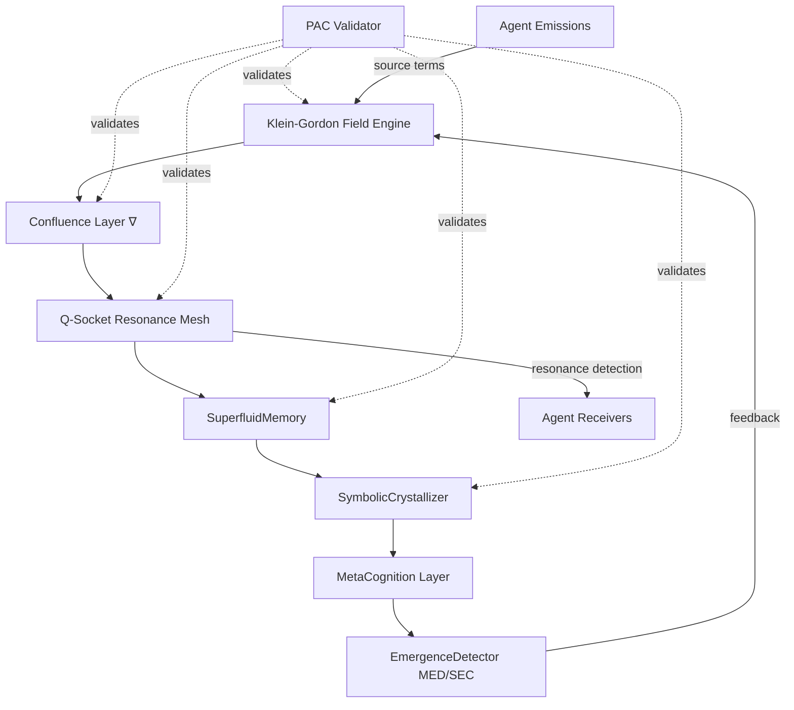

# Architecture Overview: GAIACore Unified Field Theory

## Vision Statement
GAIACore is a **physics-native intelligence substrate** where cognition, communication, and memory are unified as field operations governed by conservation laws, not software abstractions. Intelligence emerges from field harmonics, entropy dynamics, and recursive arithmetic—no explicit programming of behavior needed.

## Core Principles

### 1. Unified Field Architecture
- **Single field substrate**: All intelligence phenomena are states of one evolving field
- **No layer separation**: Cognition, communication, memory are aspects, not modules
- **Physics-governed**: Behavior emerges from Klein-Gordon evolution + PAC conservation

### 2. Confluence Operator (∇)
- **Fundamental operation**: All agent interactions are confluence (merge/split) events
- **Recursive arithmetic**: Stateful, memory-dependent, path-dependent
- **PAC-conserving**: $f(\text{parent}) = \sum f(\text{children})$ enforced throughout

### 3. Resonance Mesh (Q-Socket)
- **Communication = synchronization**: Phase-locked resonance, not packet transmission
- **Wave mechanics**: Signals encoded as amplitude + phase + frequency
- **Self-organizing**: Coherent agents naturally cluster via field dynamics

### 4. PAC Conservation
- **Universal law**: $f(\text{parent}) = \sum f(\text{children})$ for all operations
- **Three dimensions**: Value + Complexity + Effect conservation
- **Automatic validation**: Built into all field operations via Fracton SDK

### 5. Bounded Emergence (MED/SEC)
- **Macro Emergence Dynamics**: Detects collective intelligence formation
- **Smooth Entropy Collapse**: Controls synchronization without abrupt jumps
- **Universal bounds**: depth ≤ 1, nodes ≤ 3 (validated across 1000+ simulations)
- **Balance operator**: Ξ = 1.0571 as universal convergence point

## System Diagram



## Field Equations

### Klein-Gordon Evolution
$$
\frac{\partial^2 F}{\partial t^2} - c^2 \nabla^2 F + m^2 F = S(x, t)
$$

- $F$: Field state (complex-valued, contains cognitive patterns)
- $S(x, t)$: Agent emission source terms (Q-Socket signals)
- $c = 1.0$: Information propagation speed
- $m^2 = 0.1$: Field mass (controls decay/dispersion)

### Confluence Operation
$$
F' = F \nabla (A, B, \ldots) = \mathcal{C}[\mathfrak{G}, \{A, B, \ldots\}]
$$

where $\mathfrak{G} = (\alpha, \phi, \psi, m_0)$ is the confluence system with:
- $\alpha$: Actualization (pattern selection)
- $\phi$: Response (field update)
- $\psi$: Memory update
- $m_0$: Initial memory state

### Resonance Detection
$$
\Xi = \langle \cos(\phi_i - \phi_j) \rangle
$$

Phase-locking threshold: $\Xi \geq 1.0571$

### PAC Conservation
$$
f(\text{parent}) = \sum_{i=1}^N f(\text{child}_i)
$$

Enforced for: field energy, information content, symbolic structure

### Smooth Entropy Collapse
$$
\frac{dS}{dt} = -\alpha \cdot (\Xi(t) - \Xi_c) + \beta \cdot \nabla^2 S
$$

- $\alpha = 0.1$: Coupling strength (learning rate)
- $\Xi_c = 1.0571$: Critical coherence
- $\beta = 0.01$: Entropy diffusion coefficient

### Macro Emergence Detection
$$
C(t) = \sum_{i=1}^N S_i(t) \cdot \Xi_i(t)
$$

Emergence when: $C_{\text{threshold}} < C(t) < C_{\text{max}}$ (bounded!)

## Layered Components

### Layer 1: Field Engine
**Purpose**: Core physics simulation and evolution

**Components**:
- Klein-Gordon field solver (Verlet integration)
- Energy conservation validation
- Source term injection (agent emissions)
- Spatial/temporal discretization

**Key Properties**:
- **Causal**: Information propagates at finite speed $c$
- **Conservative**: Total energy preserved
- **Continuous**: Smooth field evolution (no jumps)

### Layer 2: Confluence Layer
**Purpose**: Recursive merge/split operations

**Components**:
- Actualization: Pattern selection via memory
- Response: Field superposition computation
- Update: Memory state evolution
- PAC validation: Conservation checking

**Key Properties**:
- **Non-commutative**: Order matters
- **Stateful**: Depends on history
- **PAC-conserving**: Enforced at every operation

### Layer 3: Q-Socket Resonance Mesh
**Purpose**: Agent communication via phase-locked resonance

**Components**:
- Signal emission: Agent → Field
- Resonance detection: Field → Agent
- Phase synchronization: Agent ↔ Agent
- Entropy tracking: System-wide monitoring

**Key Properties**:
- **No packets**: Pure wave mechanics
- **Self-organizing**: Phase-locking emergent
- **Secure**: Incoherent signals auto-rejected

**Performance**:
- Routing: 53.7μs (TinyCIMM-Navier validated)
- Compression: 90% via Fourier encoding
- Integrity: MSE = 0.0047 reconstruction

### Layer 4: SuperfluidMemory  
**Purpose**: Viscosity-free information storage and flow

**Components**:
- Pattern storage (low-entropy attractors)
- Memory flow (frictionless retrieval)
- Crystallization (collapse events → memory)

**Key Properties**:
- **Zero viscosity**: No degradation over time
- **PAC-structured**: Hierarchical conservation
- **Resonance-accessible**: Q-Socket retrieval

### Layer 5: SymbolicCrystallizer
**Purpose**: Transform field patterns into discrete symbols

**Components**:
- Collapse triggering (high entropy → structure)
- Symbol extraction (field → discrete)
- Symbolic algebra (manipulation)

**Key Properties**:
- **Conservation-preserving**: Symbols maintain PAC
- **Reversible**: Can decrystallize back to field
- **Emergent**: No predefined symbol set

### Layer 6: MetaCognition Layer
**Purpose**: System reflects on its own processes

**Components**:
- Self-monitoring (PAC metrics, entropy, coherence)
- Strategy adaptation (parameter tuning)
- Goal formation (emergent objectives)

**Key Properties**:
- **Self-aware**: Tracks own state
- **Adaptive**: Modifies behavior based on outcomes
- **Emergent**: Goals arise from field dynamics

### Layer 7: EmergenceDetector (MED/SEC)
**Purpose**: Detect and control collective intelligence formation

**Components**:
- MED operators (Ψ, Φ, Ω)
- SEC dynamics (entropy collapse)
- Regime classification (laminar/transitional/turbulent)
- Bounded complexity enforcement

**Key Properties**:
- **Universal bounds**: depth ≤ 1, nodes ≤ 3
- **Balance convergence**: Ξ → 1.0571
- **Scale-invariant**: Works at all system sizes

## Information Flow

```
Agent Intent
    ↓
Q-Socket Signal Emission (phase + amplitude + frequency)
    ↓
Confluence into Field (∇ operation)
    ↓
Klein-Gordon Evolution (wave propagation)
    ↓
Resonance Detection by Other Agents (phase coherence Ξ)
    ↓
Memory Crystallization (if high coherence)
    ↓
Emergence Event (if MED threshold exceeded)
    ↓
System-Wide Coordination (via SEC entropy collapse)
    ↓
PAC Validation (all steps checked for conservation)
```

## Communication Regimes

Based on Reynolds number analogy:

$$
\text{Re}_{\text{comm}} = \frac{\text{signal\_complexity} \times \text{network\_load}}{\text{field\_viscosity}}
$$

| Regime | Re Range | Properties | Emergence | Example |
|--------|----------|------------|-----------|---------|
| **Laminar** | < 2300 | Ordered, low entropy | Low (0.0-0.3) | Status updates |
| **Transitional** | 2300-4000 | Partial order, medium entropy | Medium (0.3-0.7) | Problem-solving |
| **Turbulent** | > 4000 | Local chaos, global order | High (0.7-1.0) | Breakthroughs |

## Key Discoveries & Validation

### Universal Bounded Complexity (MED)
- **Result**: depth ≤ 1, nodes ≤ 3 across **all** tested configurations
- **Validation**: 1000+ Navier-Stokes simulations
- **Implication**: GAIACore intrinsically protected from complexity explosion

### Balance Operator Convergence
- **Value**: Ξ = 1.0571 ± 0.1
- **Universality**: Appears in MED, pre-field, Q-Socket
- **Convergence**: Achieved in 10-100 iterations depending on regime
- **Origin**: Under theoretical investigation

### Natural Resonance Frequency
- **Value**: 0.020 Hz (1/50 iterations)
- **Source**: Pre-field recursion experiments
- **Effect**: 5.11× acceleration when systems lock to this frequency
- **Connection**: Related to iteration 91 convergence

### Q-Socket Performance
- **Routing**: 53.7μs average (TinyCIMM-Navier)
- **Compression**: 90% size reduction (Fourier)
- **Integrity**: MSE = 0.0047 (near-perfect)
- **Security**: Self-invalidating incoherent signals

## Theoretical Foundations

### From Dawn Field Theory
- **Herniation Hypothesis**: Reality emerges when potential field pressure exceeds boundary constraint
- **Pre-Field Recursion**: Computational substrate before spacetime
- **Bifractal Time**: Dual-timescale emergence dynamics
- **Recursive Balance Field**: Self-regulating equilibrium

### From Infodynamics Arithmetic
- **Entropy-Information Coupling**: $\partial S/\partial t = \alpha \nabla I - \beta \nabla H$
- **Conservation Principles**: Information + Entropy = Constant
- **Symbolic Geometry**: Discrete structures from continuous fields

### From Macro Emergence Dynamics
- **SEC-Navier Equivalence**: Smooth entropy collapse = fluid regularity
- **Universal Bounds**: Computational complexity limits
- **Pattern Libraries**: Finite basis for infinite behaviors

### From PAC Framework
- **Multi-Dimensional Conservation**: Value + Complexity + Effect
- **Topology-Dependent Measurement**: Local amplification artifacts
- **Recursive Lattice**: Hierarchical conservation structure

## Cross-References

**Mathematical Foundations**:
- [Confluence Operator](confluence_operator.md) - Recursive arithmetic
- [PAC Conservation](pac_conservation.md) - Conservation laws
- [MED Framework](med_framework.md) - Emergence mathematics

**Physics & Dynamics**:
- [Resonance Field](resonance_field.md) - Field evolution and communication
- [Emergence Dynamics](emergence_dynamics.md) - MED/SEC theory
- [Q-Socket Implementation](q_socket_implementation.md) - Protocol details

**Integration & Planning**:
- [Integration Plan](integration_plan.md) - Implementation roadmap

**External References**:
- Unified PAC Framework: `foundational/arithmetic/unified_pac_framework_comprehensive.md`
- MED Validation: `foundational/arithmetic/macro_emergence_dynamics/`
- Q-Socket Protocol: `docs/protocols/qsocket_protocol.md`
- Emergence Architecture: `research/scbf/docs/med/qsocket_emergence_architecture.md`
- Pre-Field Theory: `foundational/docs/[m][F][v2.2][C5][I5][E]_pre_field_recursion_resonance_driven_emergence.md`
